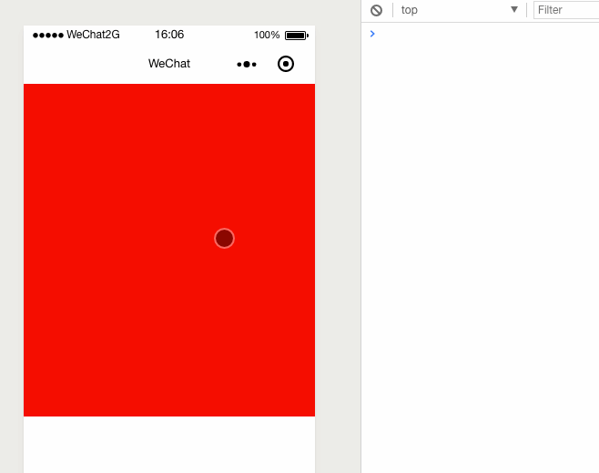

## 先看效果
 

## 定义变量
```
var touchStartX = 0;//触摸时的原点  
var touchStartY = 0;//触摸时的原点  
var time = 0;// 时间记录，用于滑动时且时间小于1s则执行左右滑动  
var interval = "";// 记录/清理时间记录  
var touchMoveX = 0; // x轴方向移动的距离
var touchMoveY = 0; // y轴方向移动的距离
```
## 定义WXML
```
<view class="duration-touch-view" 
bindtouchstart="touchStart" 
bindtouchmove="touchMove" 
bindtouchend="touchEnd" >
</view>
```
## JS 实现

```
// 触摸开始事件  
  touchStart: function (e) {
    touchStartX = e.touches[0].pageX; // 获取触摸时的原点  
    touchStartY = e.touches[0].pageY; // 获取触摸时的原点  
    // 使用js计时器记录时间    
    interval = setInterval(function () {
      time++;
    }, 100);
  },
  // 触摸移动事件  
  touchMove: function (e) {
    touchMoveX = e.touches[0].pageX;
    touchMoveY = e.touches[0].pageY;
  },
  // 触摸结束事件  
  touchEnd: function (e) {
    var moveX = touchMoveX - touchStartX
    var moveY = touchMoveY - touchStartY
    if (Math.sign(moveX) == -1) {
      moveX = moveX * -1
    }
    if (Math.sign(moveY) == -1) {
      moveY = moveY * -1
    }
    if (moveX <= moveY) {// 上下
      // 向上滑动
      if (touchMoveY - touchStartY <= -30 && time < 10) {
        console.log("向上滑动")
      }
      // 向下滑动  
      if (touchMoveY - touchStartY >= 30 && time < 10) {
        console.log('向下滑动 ');
      }
    }else {// 左右
      // 向左滑动
      if (touchMoveX - touchStartX <= -30 && time < 10) {
        console.log("左滑页面")
      }
      // 向右滑动  
      if (touchMoveX - touchStartX >= 30 && time < 10) {
        console.log('向右滑动');
      }
    }
    clearInterval(interval); // 清除setInterval  
    time = 0;
  },  

```

